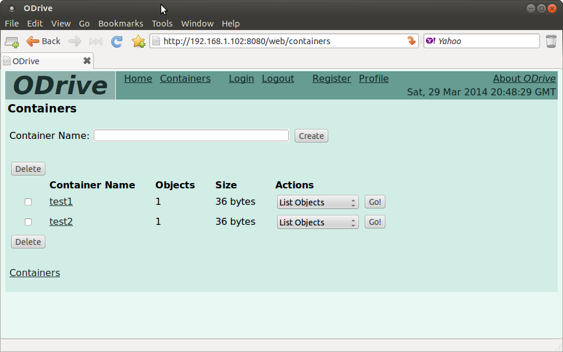

*ODrive*
========

Summary
-------

An app server front-end to object-storage services
such as OpenStack Swift

Todo
----

Currently, ODrive only provides drivers for Swift.  The objective is to
support Ceph RADOSGW, as well as other services as they come to market.

Overview
--------

ODrive provides:
  1. A Ruby application server implemented with Sinatra.
  2. A RESTful front-end, which, with driver support, can support
     multiple object-storage services, providing common services across
     object-storage back-end services.
  3. An HTML web interface to object services.

ODrive can support multiple OpenStack Swift object stores, selectable by
the user from the Profile page.  For security, the hostname for each
supported Swift object store must be specified in the source code
('./ruby/odrive/odrive_info.rb'):

    ODRIVE_HOSTS = [
      ODRIVE_INITIAL_HOST,
      'localhost',
      ...
    ]

The ODrive configuration file supports a default host, plus its
parameters.

Contents
--------

* './python' -- Miscelleaneous Python scripts loosely affiliated with ODrive, OpenStack, etc.
* './ruby/odrive' -- The ODrive application server, client programs, etc.
* './ruby/&lt;other&gt;' -- Miscelleanous test code

See Also
--------

See './ruby/README.txt' for information on launching the application server.

